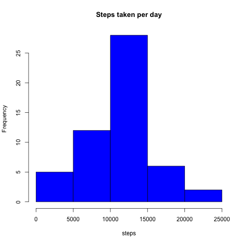
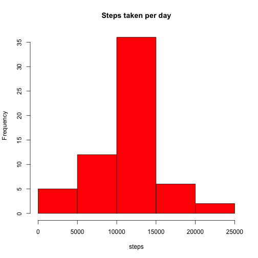

Reproducible Research - Activity
========================================================

### R Markdown: Data Science Reproducible Research course. Assignment One.

<br>
#### <u>Download the activity data into the working directory, install knitr, read in the data and convert formats.</u>


```r
act <- read.csv("~/Desktop/RR1/activity.csv")
attach(act)
steps <- as.numeric(steps)
date <- as.Date(date)
interval <- as.numeric(interval)
act <- data.frame(steps, date, interval)
rm(date, interval, steps)
```

<br>
#### <u>Create a second dataset cleaned of NAs and calculate total steps per day</u>


```r
act_clean <- act[!is.na(act$steps), ]
SpD <- aggregate(list(steps=act_clean$steps), list(date=act_clean$date), sum)
```

<br>
#### <u>Create histogram</u>


```r
hist(SpD$steps, main="Steps taken per day", xlab="steps", col="blue")
```

 

#### <u>What is the mean and the medium?</u>


```r
options(scipen = 1, digits = 2)
mean <- mean(SpD$steps)
median <- median(SpD$steps)
```

#### The mean is 10766.19.  The median is 10765

<br><br>
#### <u>Make a time series plot (i.e. type = "l") of the 5-minute interval (x-axis) and the average number of steps taken, averaged across all days (y-axis)</u>


```r
SpI <- aggregate(list(steps=act_clean$steps), list(int=act_clean$interval), mean)
plot(SpI$int, SpI$steps, type="l", xlab="Interval time (5 second)", ylab="mean steps recorded", main="Mean steps taken by 5 second intervals")
```

 

#### <u>Which 5-minute interval, on average across all the days in the dataset, contains the maximum number of steps?</u>

#### The 835 second interval on average contains the most number of steps across all the day with '206.17'.

<br><br>
#### <u>Calculate and report the total number of missing values in the dataset (i.e. the total number of rows with NAs)</u>


```r
colSums(is.na(act))
```

```
##    steps     date interval 
##     2304        0        0
```

#### The are 2304 missing values in the dataset all in the steps column.

<br>
#### <u>Devise a strategy for filling in all of the missing values in the dataset</u>

#### <u>Use a for loop to run through each row and where the value is NA replace with the mean for the number of steps for that time interval</u>


```r
fullact <- act
for (i in 1:nrow(fullact)) {
  fa <- fullact[i,]
    if(is.na(fa$steps)) {
      a <- fullact[fullact$interval==fa$interval,]
      b <- mean(a$steps, na.rm=TRUE)
      fullact[i,1] = b
    }
}
```


#### <u>Make a histogram of the total number of steps taken each day and Calculate and report the mean and median total number of steps taken per day.</u>


```r
SpDII <- aggregate(list(steps=fullact$steps), list(date=fullact$date), sum)

hist(SpDII$steps, main="Steps taken per day", xlab="steps", col="red")
```

 

```r
options(scipen = 1, digits = 2)
meanII <- mean(SpDII$steps)
medianII <- median(SpDII$steps)
```

#### The mean is 10766.19.  The median is 10766.19

#### There is very little difference between the original calculated mean and median values and the values calculated with the added values. The differences in the total daily number of steps appears to be an increase in the number of days with between 10000 and 15000 steps likely because whole days were missing and the technique used to replace them simply ended up giving those days the mean from the total dataset (10766.19)


<br>
#### <u>Create a new factor variable in the dataset with two levels – “weekday” and “weekend”</u>


```r
actw <- fullact
actw$day <- rep("weekday", nrow(actw))

for(i in 1:nrow(actw)) {
  if(weekdays(as.Date(actw[i, 'date']))=='Saturday' 
     | weekdays(as.Date(actw[i, 'date']))=='Sunday') {
    actw[i,4] <- 'weekend'
     }
}

actfact <- factor(actw$day)
acttotal <- data.frame(actw[,1:3], actfact) 
actweek <- acttotal[acttotal$actfact=='weekday',]
actend <- acttotal[acttotal$actfact=='weekend',]
```

<br>
#### <u>Make a panel plot containing a time series plot (i.e. type = "l") of the 5-minute interval (x-axis) and the average number of steps taken, averaged across all weekday days or weekend days (y-axis) </u>

#### <u>Create a plot for the weekdays and for weekends</u>

```r
acttotal <- data.frame(actw[,1:3], actfact) 
actweek <- acttotal[acttotal$actfact=='weekday',]
actend <- acttotal[acttotal$actfact=='weekend',]

par (mfrow=c(2,1))

day <- aggregate(list(steps=actweek$steps), list(int=actweek$interval), mean)
end <- aggregate(list(steps=actend$steps), list(int=actend$interval), mean)

par (mfrow=c(2,1))
plot(day$int, day$steps, type="l", xlab="Interval time (5 second)", ylab="mean steps recorded", main="Mean steps taken by 5 second intervals (weekdays)")
plot(end$int, end$steps, type="l", xlab="Interval time (5 second)", ylab="mean steps recorded", main="Mean steps taken by 5 second intervals (weekends)")
```

 
